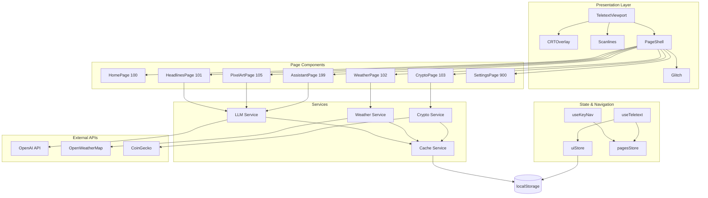

# Design Document

## Overview

Teletext Universe is a React-based web application that recreates the classic teletext experience with modern capabilities. The application renders content in a fixed-grid viewport styled to mimic 1980s CRT displays, complete with scanlines, vignette effects, and pixel fonts. Users navigate between numbered pages (100-999) using keyboard input, with each page delivering real-time content from various APIs and AI services.

The architecture follows a component-based design with clear separation between:
- **Presentation layer**: Teletext viewport, CRT effects, page shells
- **Navigation layer**: Keyboard handling, page routing, state management
- **Data layer**: API integrations, caching, localStorage persistence

## Architecture



## Components and Interfaces

### Core Components

#### TeletextViewport
The main container component that establishes the 40x25 character grid.

```typescript
interface TeletextViewportProps {
  children: React.ReactNode;
  showCRT: boolean;
  crtIntensity: number; // 0-100
}
```

#### PageShell
Wrapper for individual pages providing consistent header/footer and transition effects.

```typescript
interface PageShellProps {
  pageNumber: number;
  title: string;
  children: React.ReactNode;
}
```

#### CRTOverlay
Applies CRT visual effects including vignette and color bleeding.

```typescript
interface CRTOverlayProps {
  intensity: number; // 0-100
  enabled: boolean;
}
```

### Page Components

Each page component follows a consistent interface:

```typescript
interface TeletextPageProps {
  isActive: boolean;
  onNavigate: (pageNumber: number) => void;
}
```

### Hooks

#### useKeyNav
Handles keyboard navigation and page number buffering.

```typescript
interface UseKeyNavReturn {
  currentPage: number;
  pageBuffer: string;
  navigateTo: (pageNumber: number) => void;
  goNext: () => void;
  goPrevious: () => void;
}
```

#### useTeletext
Manages teletext-specific rendering utilities.

```typescript
interface UseTeletextReturn {
  formatText: (text: string, maxWidth: number) => string[];
  renderBlock: (char: string, color: TeletextColor) => React.ReactNode;
  playSound: (soundType: 'switch' | 'error' | 'success') => void;
}
```

### Services

#### LLMService
Handles all OpenAI API interactions.

```typescript
interface LLMService {
  summarizeHeadlines(rawContent: string): Promise<Headline[]>;
  generatePixelArt(prompt: string): Promise<PixelArtGrid>;
  chat(message: string, history: ChatMessage[]): Promise<AssistantResponse>;
}

interface Headline {
  title: string;
  snippet: string;
  source: string;
}

interface PixelArtGrid {
  pixels: string[][]; // 8x8 array of hex colors
}

interface AssistantResponse {
  message: string;
  suggestions: string[];
}
```

#### WeatherService
Fetches weather data from OpenWeatherMap.

```typescript
interface WeatherService {
  getCurrentWeather(city: string): Promise<WeatherData>;
  getHourlyForecast(city: string): Promise<HourlyForecast[]>;
}

interface WeatherData {
  city: string;
  temperature: number;
  condition: string;
  icon: string;
  humidity: number;
}

interface HourlyForecast {
  hour: number;
  temperature: number;
  condition: string;
}
```

#### CryptoService
Fetches cryptocurrency data from CoinGecko.

```typescript
interface CryptoService {
  getTopCoins(limit: number): Promise<CoinData[]>;
}

interface CoinData {
  id: string;
  name: string;
  symbol: string;
  price: number;
  change24h: number;
}
```

#### CacheService
Manages localStorage caching with TTL.

```typescript
interface CacheService {
  get<T>(key: string): T | null;
  set<T>(key: string, value: T, ttlMinutes: number): void;
  clear(key: string): void;
  isExpired(key: string): boolean;
}

interface CacheEntry<T> {
  data: T;
  timestamp: number;
  ttl: number;
}
```

### State Management (Zustand)

#### uiStore
```typescript
interface UIState {
  crtIntensity: number;
  volume: number;
  theme: 'retro' | 'modern';
  setCrtIntensity: (value: number) => void;
  setVolume: (value: number) => void;
  setTheme: (theme: 'retro' | 'modern') => void;
}
```

#### pagesStore
```typescript
interface PagesState {
  currentPage: number;
  pageHistory: number[];
  pageBuffer: string;
  isTransitioning: boolean;
  setCurrentPage: (page: number) => void;
  appendToBuffer: (digit: string) => void;
  clearBuffer: () => void;
  setTransitioning: (value: boolean) => void;
}
```

## Data Models

### Page Registry
```typescript
interface PageDefinition {
  number: number;
  title: string;
  component: React.ComponentType<TeletextPageProps>;
  category: 'info' | 'interactive' | 'settings';
}

const PAGE_REGISTRY: PageDefinition[] = [
  { number: 100, title: 'HOME', component: HomePage, category: 'info' },
  { number: 101, title: 'AI HEADLINES', component: HeadlinesPage, category: 'info' },
  { number: 102, title: 'WEATHER', component: WeatherPage, category: 'interactive' },
  { number: 103, title: 'CRYPTO', component: CryptoPage, category: 'info' },
  { number: 105, title: 'PIXEL ART', component: PixelArtPage, category: 'interactive' },
  { number: 199, title: 'ASSISTANT', component: AssistantPage, category: 'interactive' },
  { number: 900, title: 'SETTINGS', component: SettingsPage, category: 'settings' },
];
```

### Teletext Character Grid
```typescript
interface TeletextCell {
  char: string;
  foreground: string; // hex color
  background: string; // hex color
  blink: boolean;
}

type TeletextGrid = TeletextCell[][]; // 25 rows x 40 cols
```

### Settings Model
```typescript
interface UserSettings {
  crtIntensity: number;
  volume: number;
  theme: 'retro' | 'modern';
  lastCity: string;
}
```


## Correctness Properties

*A property is a characteristic or behavior that should hold true across all valid executions of a system-essentially, a formal statement about what the system should do. Properties serve as the bridge between human-readable specifications and machine-verifiable correctness guarantees.*

### Property 1: Page Buffer Accumulation

*For any* sequence of digit key presses (0-9), the Page Buffer SHALL contain exactly those digits in the order they were pressed, until the buffer reaches 3 digits.

**Validates: Requirements 2.1**

### Property 2: Sequential Page Navigation

*For any* current page in the page registry, pressing the right arrow key SHALL navigate to the next valid page number in the registry, and pressing the left arrow key SHALL navigate to the previous valid page number, wrapping at boundaries.

**Validates: Requirements 2.3**

### Property 3: Invalid Page Rejection

*For any* three-digit number that is not in the page registry, entering that number SHALL leave the current page unchanged and the system SHALL remain on the same page.

**Validates: Requirements 2.5**

### Property 4: Headlines Rendering Completeness

*For any* array of headline objects received from the LLM service, the rendered output SHALL contain the title, snippet, and source for each headline.

**Validates: Requirements 4.2**

### Property 5: Weather Data Rendering Completeness

*For any* weather data object received from the API, the rendered output SHALL contain the temperature value and weather condition.

**Validates: Requirements 5.3**

### Property 6: Crypto Data Rendering Completeness

*For any* array of coin data objects received from the API, the rendered output SHALL contain the coin name, current price, and 24-hour change percentage for each coin.

**Validates: Requirements 6.2**

### Property 7: Pixel Art Grid Structure

*For any* pixel art data received from the LLM service, the rendered grid SHALL contain exactly 64 cells (8 rows × 8 columns) with valid color values.

**Validates: Requirements 7.3**

### Property 8: Text Line Wrapping

*For any* text string rendered in the teletext viewport, each line in the output SHALL be at most 40 characters in length, with words wrapped appropriately.

**Validates: Requirements 8.3**

### Property 9: Assistant Response Rendering

*For any* assistant response containing a message and suggestions array, the rendered output SHALL display the message with proper line wrapping AND display between 2-3 suggested follow-up questions.

**Validates: Requirements 8.3, 8.4**

### Property 10: Settings Round-Trip Persistence

*For any* valid settings object (crtIntensity, volume, theme), saving to localStorage and then loading SHALL return an equivalent settings object.

**Validates: Requirements 9.3, 9.4**

## Error Handling

### API Error Handling Strategy

All external API calls follow a consistent error handling pattern:

```typescript
interface ApiResult<T> {
  success: boolean;
  data?: T;
  error?: string;
}

async function fetchWithFallback<T>(
  fetcher: () => Promise<T>,
  cacheKey: string,
  ttlMinutes: number
): Promise<ApiResult<T>> {
  // 1. Check cache first
  const cached = cacheService.get<T>(cacheKey);
  if (cached) return { success: true, data: cached };
  
  // 2. Attempt fetch
  try {
    const data = await fetcher();
    cacheService.set(cacheKey, data, ttlMinutes);
    return { success: true, data };
  } catch (error) {
    // 3. Return error state for UI to handle
    return { success: false, error: 'Service unavailable' };
  }
}
```

### Error Display

Each page component handles errors by displaying a teletext-styled error block:

```
╔══════════════════════════════════════╗
║  SERVICE TEMPORARILY UNAVAILABLE     ║
║  Please try again later              ║
║  Press any key to return to HOME     ║
╚══════════════════════════════════════╝
```

### Navigation Error Handling

- Invalid page numbers: Display brief error flash, remain on current page
- Page buffer timeout: Clear buffer after 3 seconds of inactivity
- Missing page component: Redirect to page 100 (Home)

## Testing Strategy

### Testing Framework

- **Unit Testing**: Vitest for fast unit tests
- **Property-Based Testing**: fast-check library for property-based tests
- **Component Testing**: React Testing Library for component behavior

### Unit Tests

Unit tests cover specific examples and edge cases:

1. **Navigation Tests**
   - Page buffer correctly accumulates digits
   - Arrow keys navigate to correct pages
   - Invalid pages show error state

2. **Rendering Tests**
   - Viewport renders correct grid dimensions
   - CRT effects apply correct CSS classes
   - Page components render required elements

3. **Service Tests**
   - Cache service correctly stores/retrieves with TTL
   - API services handle success and error responses

### Property-Based Tests

Each correctness property is implemented as a property-based test using fast-check:

- Configure minimum 100 iterations per property test
- Tag each test with: `**Feature: teletext-universe, Property {number}: {property_text}**`
- Use smart generators that constrain inputs to valid domain values

Example property test structure:

```typescript
import { fc } from 'fast-check';

describe('Page Navigation', () => {
  // **Feature: teletext-universe, Property 1: Page Buffer Accumulation**
  it('accumulates digits in order until 3 digits', () => {
    fc.assert(
      fc.property(
        fc.array(fc.integer({ min: 0, max: 9 }), { minLength: 1, maxLength: 5 }),
        (digits) => {
          const buffer = new PageBuffer();
          digits.forEach(d => buffer.append(d.toString()));
          const expected = digits.slice(0, 3).join('');
          return buffer.value === expected;
        }
      ),
      { numRuns: 100 }
    );
  });
});
```

### Test Organization

```
src/
├── __tests__/
│   ├── unit/
│   │   ├── navigation.test.ts
│   │   ├── cache.test.ts
│   │   └── services.test.ts
│   └── properties/
│       ├── navigation.property.test.ts
│       ├── rendering.property.test.ts
│       └── persistence.property.test.ts
```

### Integration Points

- Mock external APIs (OpenAI, OpenWeatherMap, CoinGecko) in tests
- Use localStorage mock for persistence tests
- Test keyboard events with simulated key presses
